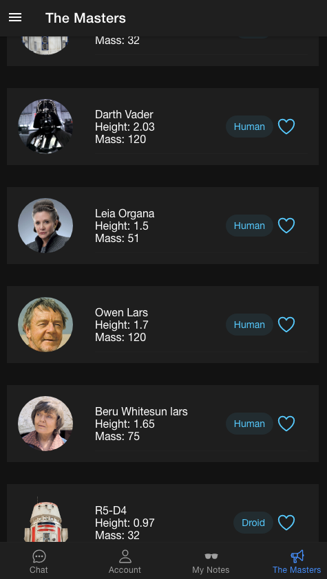

# Yoobic Hiring Challenge

## The Challenge

- To build an application in Ionic / Angular that displays a list of missions with views including a master view, detail view, menu and sign in.

## Getting Started

Clone this repo and move into the project directory.
Run `yarn install` to ensure all dependencies are installed.

```
$ git clone https://github.com/philsmithies/yoobic.git
$ cd yoobic/themasters
$ yarn install
$ ionic serve
```

Visit `http://localhost:8100/` to view the app

Login:


Master View:


Details:


Chat:


## My Approach

- I wanted to take on this technical test from YOOBIC as a great learning opportuanity. I had previously used mainly React and had always wanted to work with Angular.
  <br/>
- For the brief I wanted to run with the original concept of having a an application that leveraged an API but also was fully functional and would work as a standalone application with working views and logic.
  <br/>
- Seperating my views from my logic became a joy to work with after the initial learning curve. It meant that the code was well structured by default and is (hopefully) easier to read for other developers that come to work on the project.

## Features

- **Sign In / Sign Up**
  This includes a standard email and password entry with a dummy account for the users that want to test out the application. I also added a Github OATH sign in for those that didn't want to use a email.
  <br/>

- **Chat Application**
  It uses web sockets via supabase subscriptions to deliver a live messenger that works instantly between users and retrieves the data on each message that is added.
  <br/>

- **Master List**
  A list view using ionic components. It cycles through an API I found that is like the Star Wars API except is has photos attached (https://akabab.github.io/starwars-api/) which I wanted to make the website a better experience for the user. A lot of the photos contained broken links so I scraped the data and uploaded it to my own database.
  <br/>

- **Details**

  Each master has a Top Trumps style profile page where you can view more details about all the masters.
  <br/>

- **Hosted Postgres Backend**

  I wanted the application to work remotely without the need for a local database running so this was a key feature to get from the start. I opted for Supabase as it is built on top of web sockets which I wanted to leverage for the live chat.
  <br/>

- **Private Notes List**

  Although not in the brief it was on one of the wireframes. Whilst learning Angular I built a CRUD application and I expanded this to build a notes app that is only visible to each individual.
  <br/>

## User Stories

```
A user can sign in with a borrowed password
So that a user can view all the masters in the area
```

```
A user can navigate the site with a navbar
So that the user can find all the best masters.
```

```
The user can view a feed of all the latest masters in town
So that the user can know which to select
```

```
The user should be able to view more details about the masters
So that the user can make the right choice when deciding
```

## Bonus

```
The user should be able to chat to one of the other users using a messenger
So the user can get to know the community better
```
